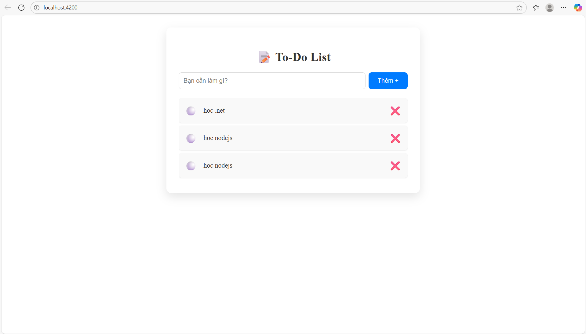
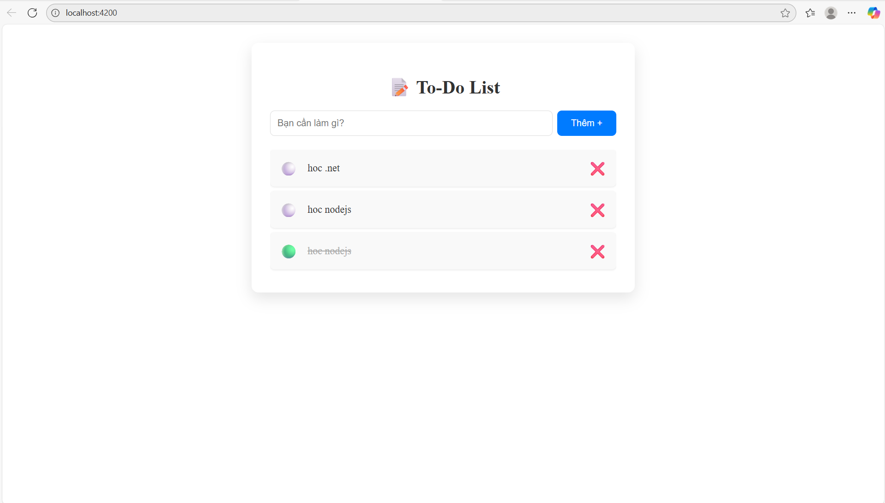
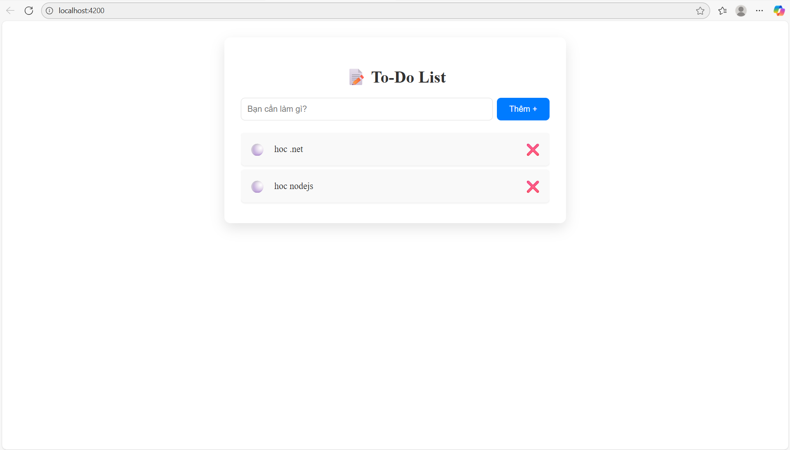
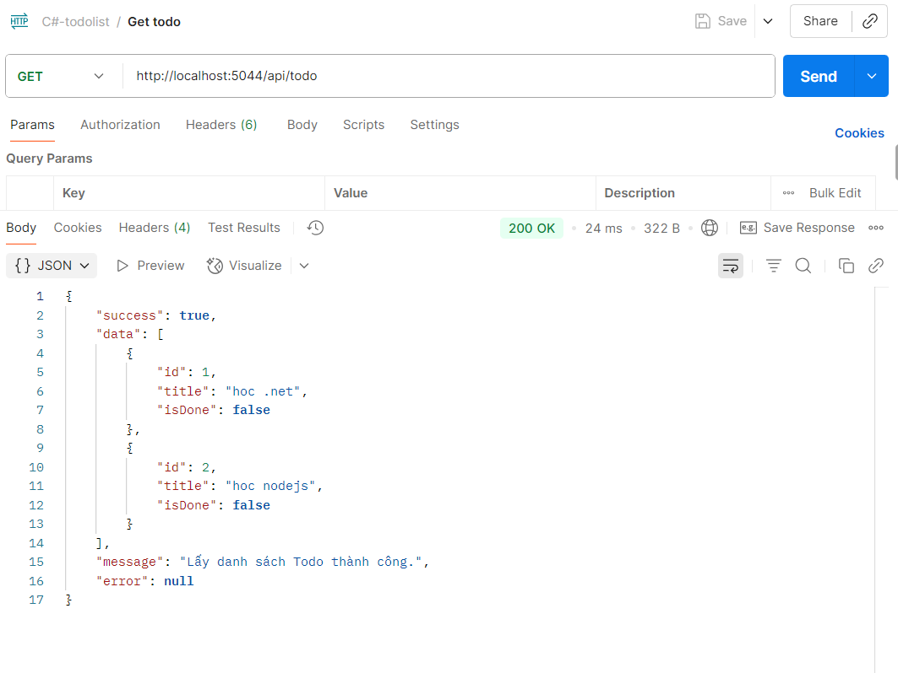
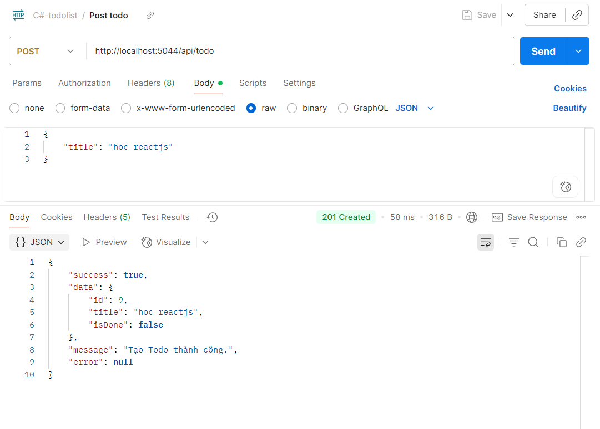
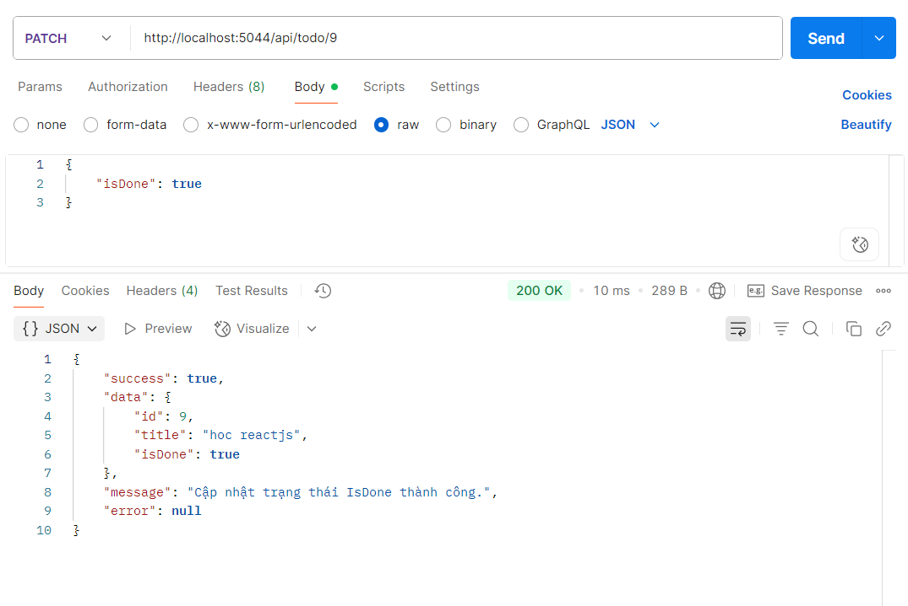
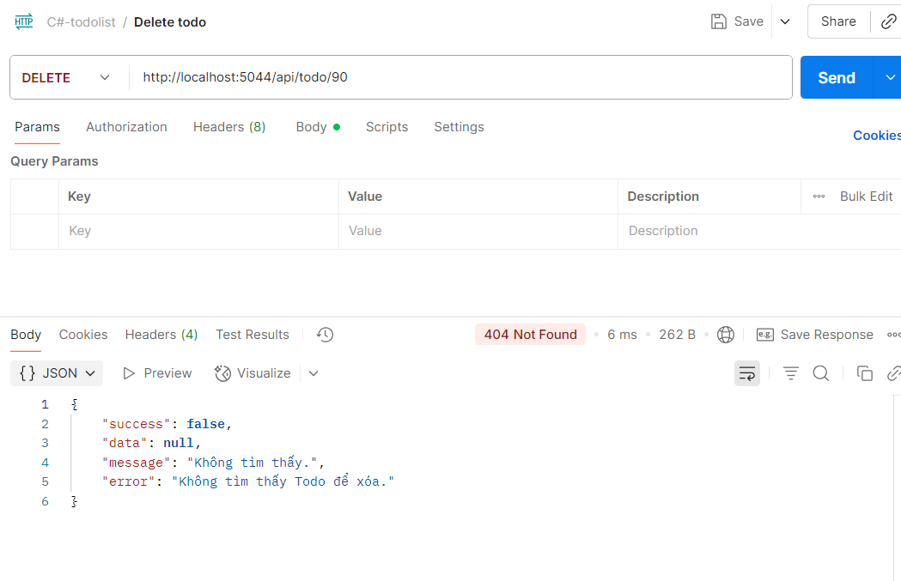

# Fullstack App TodoList (.NET 9 Web API + MySQL + Angular)

### Giới thiệu
Dự án gồm:
- **Backend:** .NET 9 Web API (Entity Framework Core + MySQL)
- **Frontend:** Angular

### Các chức năng đã làm
Backend API: CRUD Todo, kết nối DB MySQL
Frontend Angular: hiển thị danh sách Todo, thêm, xóa, đánh dấu hoàn thành.
Kết nối frontend và backend qua REST API.

### Cách chạy ứng dụng
## Backend (.NET 9 API)
Mở file `TodoApi/appsettings.json` và chỉnh lại tên server mysql ConnectionStrings phù hợp:
Vào MySQL và tạo database trống
Nếu repo đã có sẵn folder Migrations: chạy lệnh `dotnet ef database update`
Nếu repo chưa có Migrations: chạy lệnh `dotnet ef migrations add init` và `dotnet ef database update`
`dotnet watch run`
Mặc định backend chạy cổng http://localhost:5044
## Frontend (Angular)
`npm install`
`ng serve --open`
Mặc định frontend chạy cổng http://localhost:4200
Nếu frontend chạy khác cổng 4200 thì bạn phải vào Program.cs sửa lại để không bị lỗi Cors

### Khó khăn
Angular gọi API: bị lỗi CORS do chưa bật builder.Services.AddCors trong Program.cs.
Angular sinh ra rất nhiều file và thư mục khi tạo project (app.module.ts, app.component.ts, environment.ts…), lúc đầu khó hiểu mối liên hệ giữa chúng.
Khái niệm mới nhiều của Angular
Việc sử dụng Dependency Injection và tổ chức Repository cũng cần thời gian làm quen

### Giao diện demo

